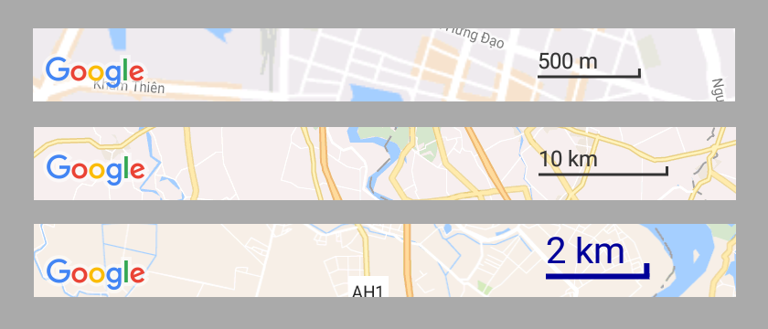

# Map Scale View
[  ](https://bintray.com/pengrad/maven/mapscaleview/_latestVersion)
[](https://android-arsenal.com/details/1/4541)

Scale view for any Android Maps SDK (not only Google Maps)



Include in layout file over map
```xml
<FrameLayout
    xmlns:android="http://schemas.android.com/apk/res/android"
    xmlns:app="http://schemas.android.com/apk/res-auto"
    android:id="@+id/activity_main"
    android:layout_width="match_parent"
    android:layout_height="match_parent">

    <fragment
        android:id="@+id/mapFragment"
        class="com.google.android.gms.maps.SupportMapFragment"
        android:layout_width="match_parent"
        android:layout_height="match_parent"/>

    <com.github.pengrad.mapscaleview.MapScaleView
        android:id="@+id/scaleView"
        android:layout_width="wrap_content"
        android:layout_height="wrap_content"
        android:layout_gravity="bottom|end"
        android:layout_margin="4dp"/>
</FrameLayout>
```

With miles or custom style
```xml
<com.github.pengrad.mapscaleview.MapScaleView
        android:id="@+id/scaleView"
        android:layout_width="wrap_content"
        android:layout_height="wrap_content"
        android:layout_gravity="bottom|end"
        android:layout_margin="4dp"
        app:scale_color="#009"
        app:scale_miles="true"
        app:scale_strokeWidth="3dp"
        app:scale_textSize="20sp"/>
```

Update on map changed
```java
MapScaleView scaleView = (MapScaleView) findViewById(R.id.scaleView);
CameraPosition cameraPosition = map.getCameraPosition();
// need to pass zoom and latitude
scaleView.update(cameraPosition.zoom, cameraPosition.target.latitude);
```

Full example with subscribing to map events and updating scale view
```java
@Override
public void onMapReady(GoogleMap googleMap) {
    map = googleMap;
    googleMap.setOnCameraMoveListener(this);
    googleMap.setOnCameraIdleListener(this);
    googleMap.setOnCameraChangeListener(this);
}

@Override
public void onCameraMove() {
    CameraPosition cameraPosition = map.getCameraPosition();
    scaleView.update(cameraPosition.zoom, cameraPosition.target.latitude);
}

@Override
public void onCameraIdle() {
    CameraPosition cameraPosition = map.getCameraPosition();
    scaleView.update(cameraPosition.zoom, cameraPosition.target.latitude);
}

@Override
public void onCameraChange(CameraPosition cameraPosition) {
    scaleView.update(cameraPosition.zoom, cameraPosition.target.latitude);
}
```

# Download
```groovy
dependencies {
    compile 'com.github.pengrad:mapscaleview:1.3.0'
}
```

